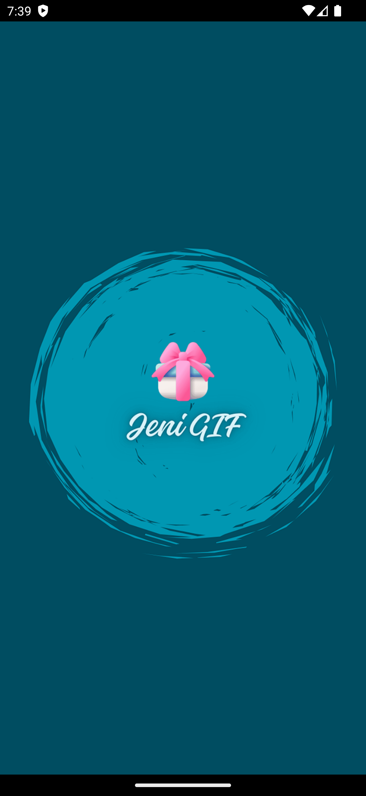
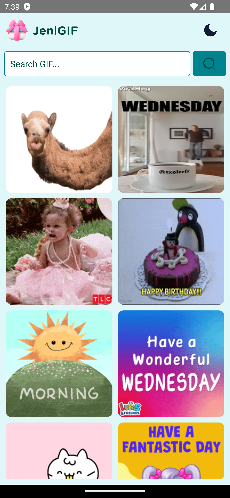
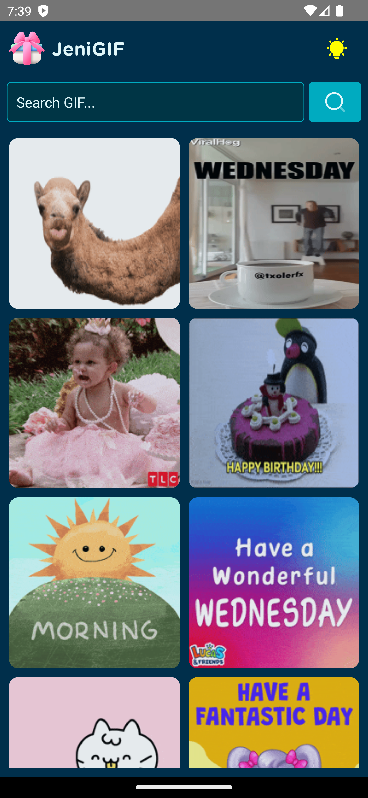
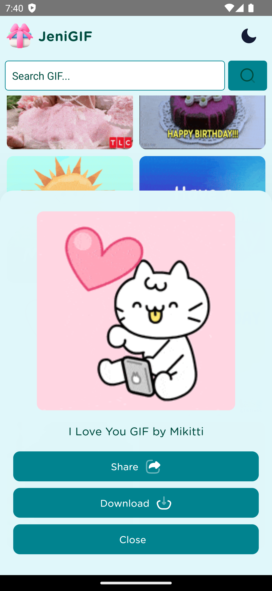
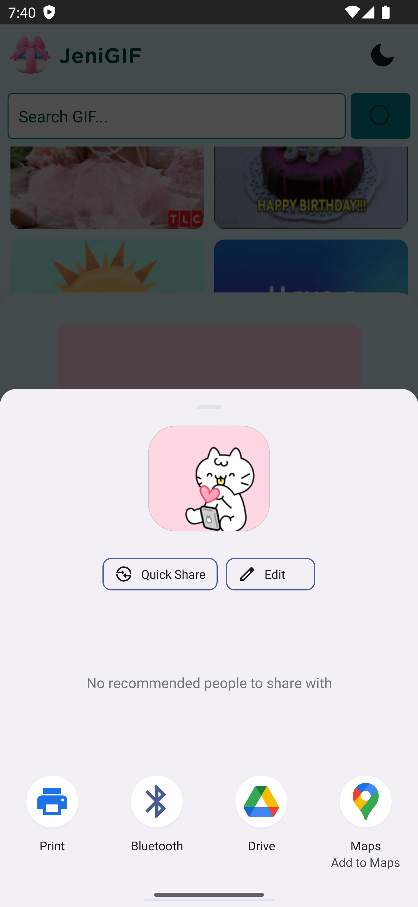
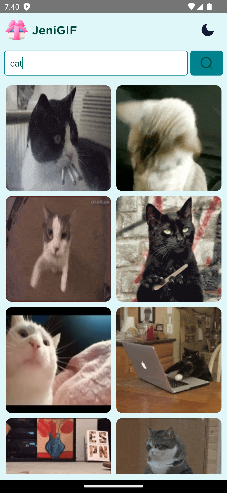
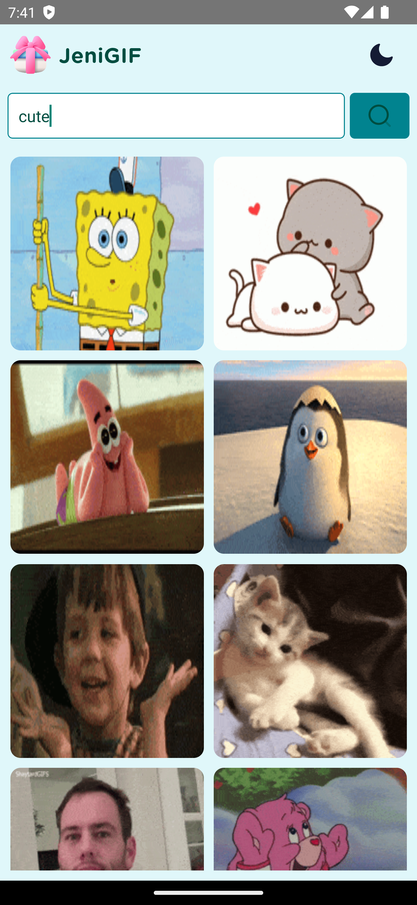
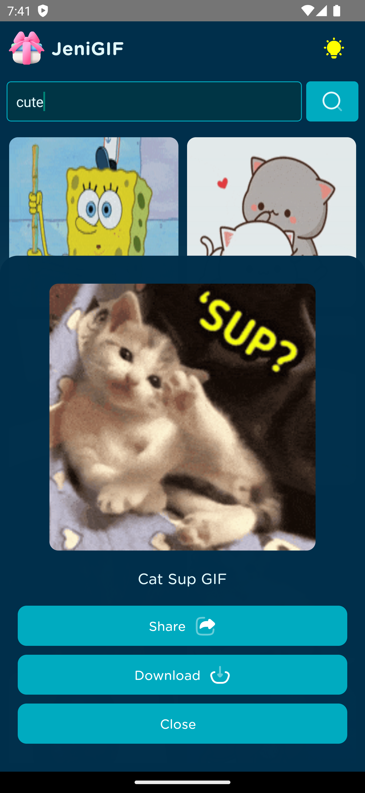

    
    <h1> Jeni GIF </h1>
    <h3>Welcome to JeniGIF</h3> 
    
 Your ultimate GIF companion! Share, search, and download your favorite GIFs in a tap! 🎉✨

---

  
  
  

  
  
  

  
  
  

## 🎉 JeniGIF - Your Ultimate GIF Experience 🎬
- 🔄 Search Any GIF
- 📤 Share with Friends
- 📥 Download Instantly
- 🎯 Filter Your Results
- 🖼️ Easy Access to All GIFs
- ✨ Customizable Experience
- 🎉 Endless Entertainment

## 📥 Download

## 📢 Disclaimer
This project and its contents are not affiliated with, funded, authorized, endorsed by, or in any way associated with any GIF-related service providers.

Any trademark, service mark, trade name, or other intellectual property rights used in this project are owned by the respective owners.
